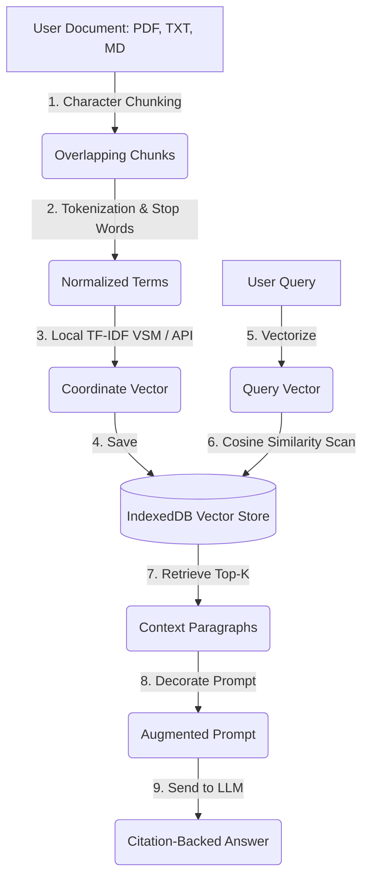

# 📖 Smart RAG Vault - App Overview & Architecture

Smart RAG Vault is an interactive simulation environment designed to make the mechanics of **Retrieval-Augmented Generation (RAG)** transparent, visual, and easy to understand. By implementing a vector database and text parsing system directly in the user's browser, the application allows you to explore the lifecycle of an AI query step-by-step.

---

## 🧭 Core RAG Concepts Explained

Large Language Models (LLMs) are frozen in time and do not have access to private, proprietary, or real-time data. RAG solves this limitation by acting like an **"Open Book" exam**. 

Instead of training or fine-tuning the model (which is slow and expensive), the application:
1.  Searches a **local database** for chunks of text matching the user's query.
2.  Retrieves the most relevant facts.
3.  Pastes those facts directly into the prompt context window.
4.  Asks the LLM to write a response based **only** on the retrieved facts, citing its sources.

---

## 🛠️ The Architecture Under the Hood

### 1. Document Ingestion & Chunking
When a document is uploaded, it is split into paragraphs or blocks of characters called **Chunks**. 
*   **Chunk Size:** Specifies the length of each text block (default: 500 characters).
*   **Chunk Overlap:** Stretches a portion of the previous block into the next block (default: 100 characters). This ensures that sentences cut off at the edge of a chunk are preserved in the next block, preventing context loss.

### 2. Semantic Embedding Generation
To compare text search terms mathematically, text chunks are turned into coordinates (vectors). The app supports two modes:
*   **Local VSM (Vector Space Model):** Implements a **TF-IDF (Term Frequency-Inverse Document Frequency)** algorithm inside the browser. It builds a vocabulary from all indexed chunks, filters out common stop words, and assigns weights to coordinates based on word scarcity. If a word is rare across the document library but frequent in a specific chunk, its TF-IDF coordinate is high.
*   **Neural Embeddings (API):** Connects to Google Gemini (`text-embedding-004`) or OpenAI (`text-embedding-3-small`) to generate dense conceptual vectors (768 or 1536 dimensions) using deep learning model representations.

### 3. Local IndexedDB Vector Database
All generated document records, metadata, text chunks, and vector coordinate arrays are stored on your local computer using the browser's **IndexedDB** engine. No files are uploaded to any external server during ingestion in Local VSM mode.

### 4. Vector Search (Cosine Similarity Scan)
When you ask a question, the application turns the query into a vector ($A$) and scans all database chunk vectors ($B$) using the **Cosine Similarity** formula:

$$\text{Similarity}(A, B) = \frac{A \cdot B}{\|A\| \|B\|} = \frac{\sum_{i=1}^{n} A_i B_i}{\sqrt{\sum_{i=1}^{n} A_i^2} \sqrt{\sum_{i=1}^{n} B_i^2}}$$

This calculates the cosine of the angle between the two vectors. 
*   If the angle is $0^\circ$ (meaning the vectors point in the exact same direction), similarity is **100%**.
*   If the vectors are orthogonal (no shared words), similarity is **0%**.
*   The top **K** chunks exceeding the similarity threshold are selected.

### 5. Prompt Decoration & LLM Generation
The retrieved chunks are formatted into a single structured text layout:
1.  **System Instructions:** Restricts the AI to rely strictly on the context chunks and cite them as references.
2.  **Context Chunks:** List of document names, chunk indexes, and raw text.
3.  **User Question:** The original query.

This augmented prompt is transmitted directly to the selected LLM provider (Gemini or OpenAI), returning a grounded, citation-backed response.

---

## 🎛️ App Workspaces & Workflows

1.  **AI Agent Chat:** A conversational assistant. When you submit a question, it queries your local IndexedDB database, finds matching paragraphs, prints citations (e.g. `[chef_menu.txt (Chunk #1)]`), and displays clickable source cards underneath the response.
2.  **Knowledge Vault:** The central control dashboard. You can upload files, preview how they will be segmented under different chunk size/overlap settings, and view a visual 12-sample **heat map visualization** of the raw vector arrays in your database.
3.  **RAG Playground:** A debugging environment. It exposes the "black box" of AI pipelines, showing you the exact tokens extracted from your query, the TF-IDF math table, a comparison table of similarity scores for every document, and the exact string sent to the LLM.
4.  **RAG Academy:** An interactive classroom. It visualizes coordinate space, plots vector angles, and houses a simulator displaying data packet packets moving from user to embedding engine, database scan, vault retrieval, prompt builder, and finally the LLM brain.
